  
---
title: "ECO 395M: Exercises 1"
author: "Nan Zhang (nz2996)"
output: md_document
---

# ECO 395M: Exercises 1

```{r, setup, include=FALSE}
knitr::opts_chunk$set(echo = TRUE, wwarning = FALSE)
```

## 1) Data visualization: gas prices 
### A) Gas stations charge more if they lack direct competition in sight.

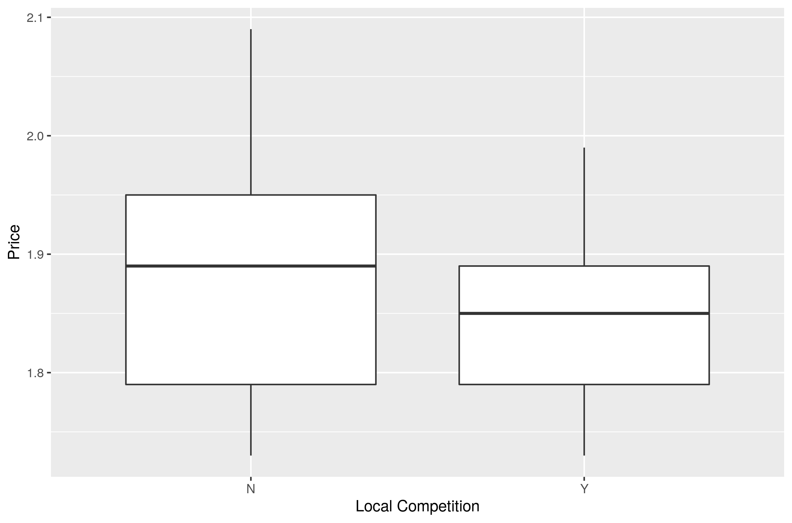

The boxplot shows that the gas price in the gas station tends to be higher when it lacks direct competition in sight.

### B) The richer the area, the higher the gas price.

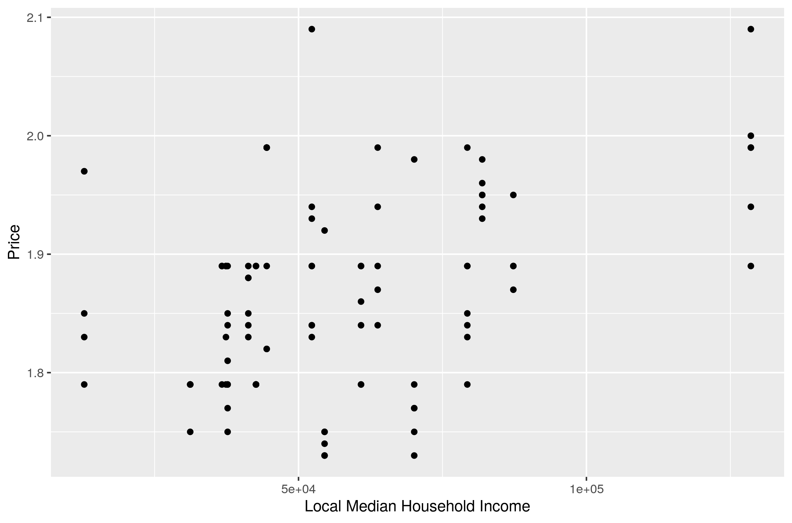

The scatter plot shows that the gas price in richer areas tends to be higher, but the trend is not significant.

### C) Shell charges more than other brands.

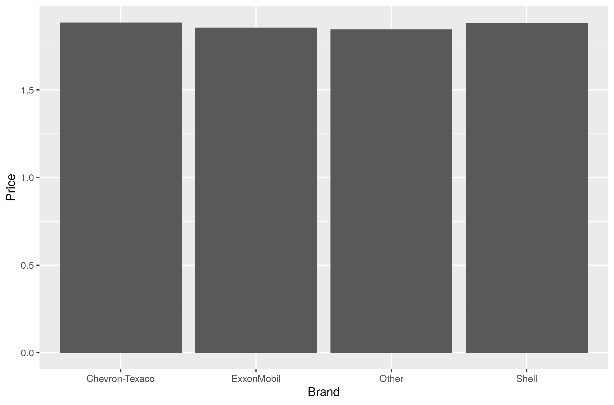

We cannot claim that Shell charges more than other brands from the bar plot.

### D) Gas stations at stoplights charge more.

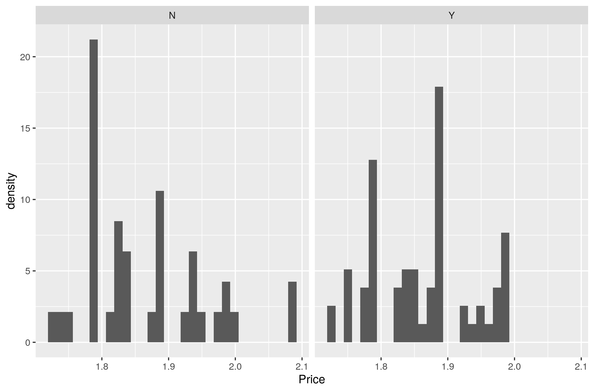

We cannot tell that gas stations at stoplights charge more from the histogram plot.

### E) Gas stations with direct highway access charge more.

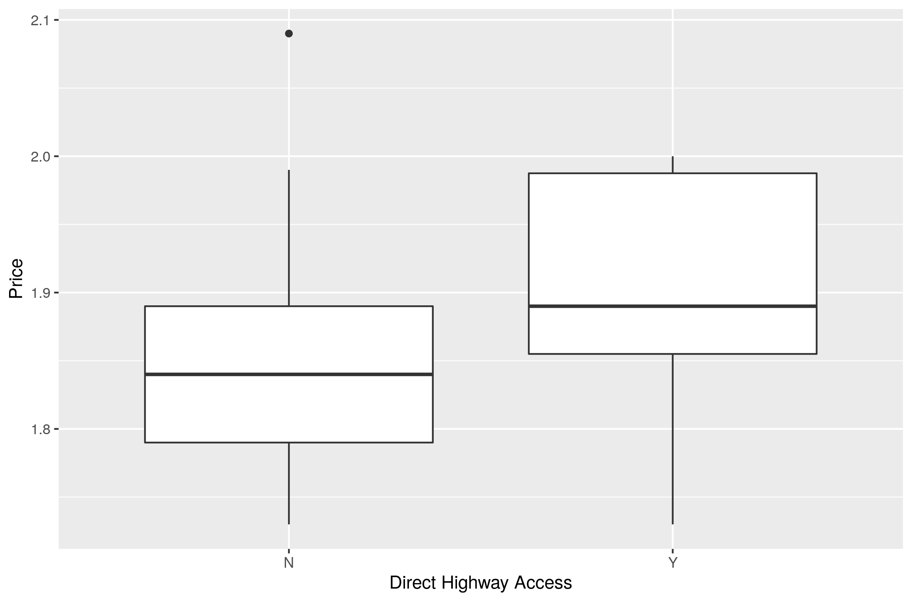

As shown in the boxplot, the gas stations with direct highway access charge more.

## 2) Data visualization: a bike share network

### A) Plot A: a line graph showing average bike rentals (total) versus hour of the day (hr).

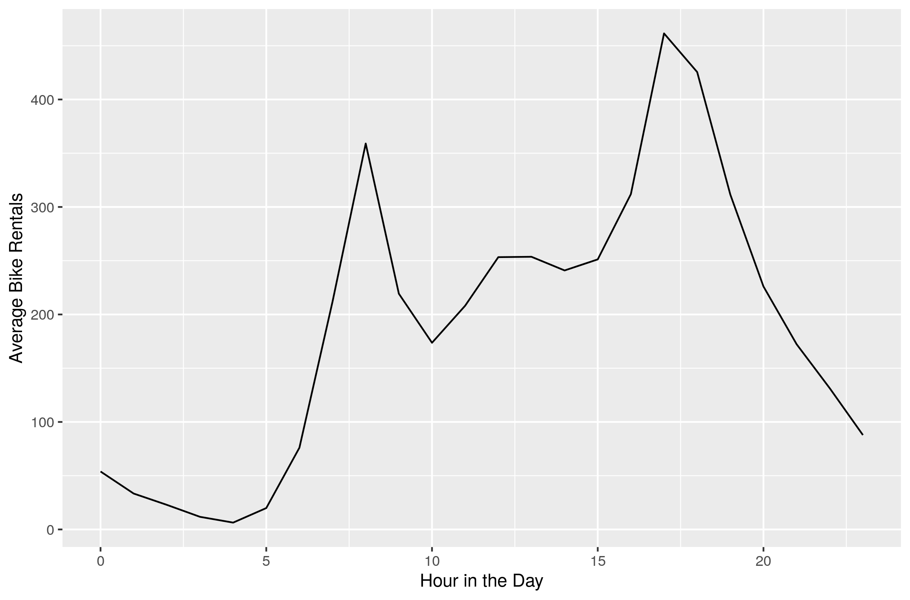

This figure directly depicits the overall ridership pattern. Generally, the average bike rentals begin rising after 5 AM., flunctuate till 6 PM and decline since then.

### B) Plot B: a faceted line graph showing average bike rentals versus hour of the day, faceted according to whether it is a working day.

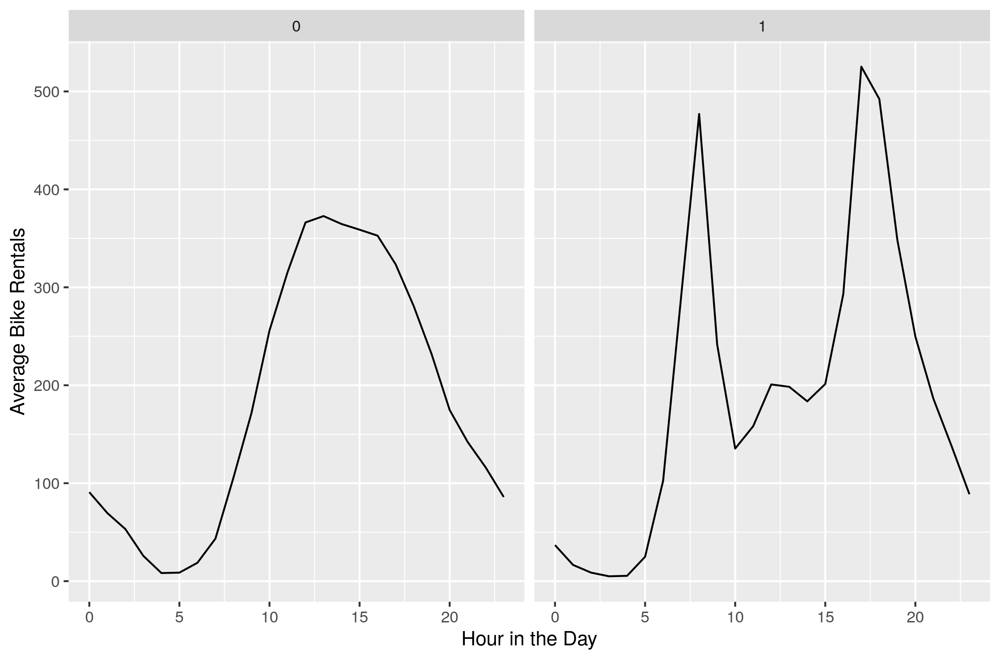

The ridership patterns in working days and innon-working days are significantly different. During working days, the rentals reach peaks at 8 AM and 17 PM., which exactly corridence the normal working time. Compared to that, the curve of daily rental pattern in non-working days are much more smooth. 

### C) Plot C: a faceted bar plot showing average ridership during the 8 AM hour by weather situation code, faceted according to whether it is a working day or not.

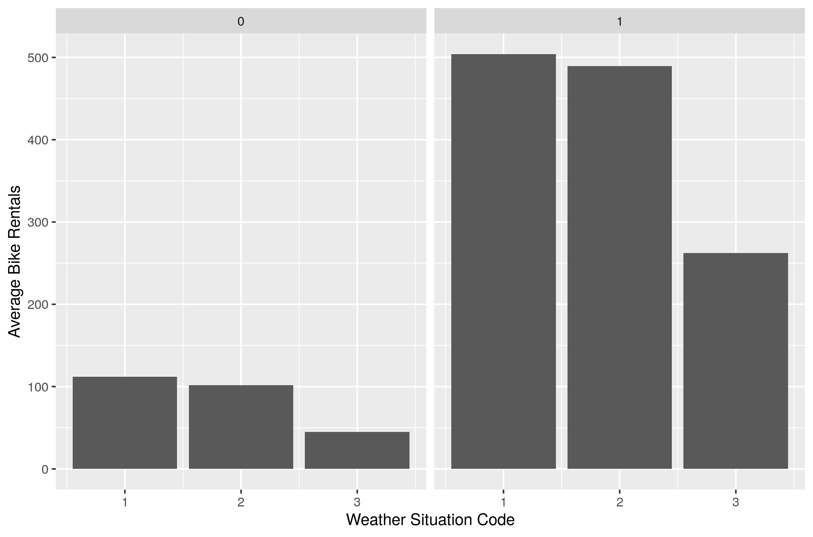

As shown and analyzed in B), the average ridership during the 8 AM in working days is significantly higher than it in non-working days. In addition, weather tends to have sigfinifant impacts on the ridership. Specifically, people are less likely to ride when it is rainy or snowny in both working and non-working days.

## 3) Data visualization: flights at ABIA
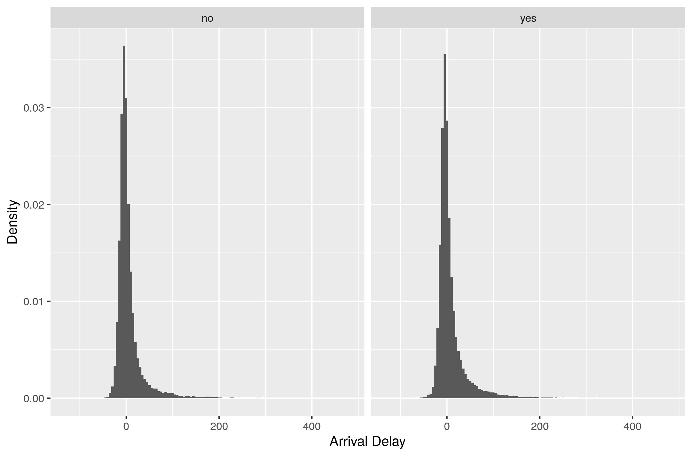

We first take a look on the difference between the arrival and departure flights in ABIA. From the above histograms, we cannot tell significant difference in the delays between arrival flights and departure flights, which may indicates that the operation of ABIA is not worse than the average level of airports across the country.


Second, we aim to figure out the relaship between arrival delay and flight distance. Suprisingly, we don't find any evidence indicating that the arrival delay is highly related to the flight distance. It is also worth to observe that flights distances are very discrete in x axis, especially when they are less than 500 miles or 1500 miles because flights with those distances are less than those with medium distances. 

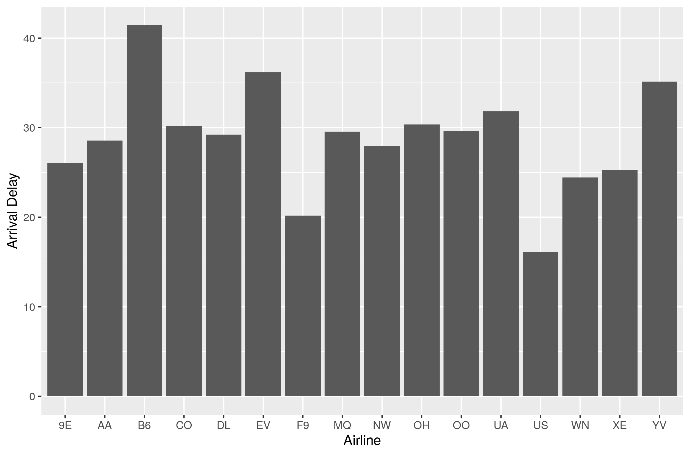

At last, we draw a bar plot to show the relationship between arrival delay and airlines. We find that US Airways has the best performance on arrival delays, while JetBlue has the poorest performance. However, we need to be clear that the arrival delay is not the only standard to justify the service quality of airlines.

## 4) K-nearest neighbors

We first fliter the data with trim 350 and then split it into a training and a testing set. We use a 5-fold cross validation to train KNN models for different K on the training set and plot means and std errors versus K. 

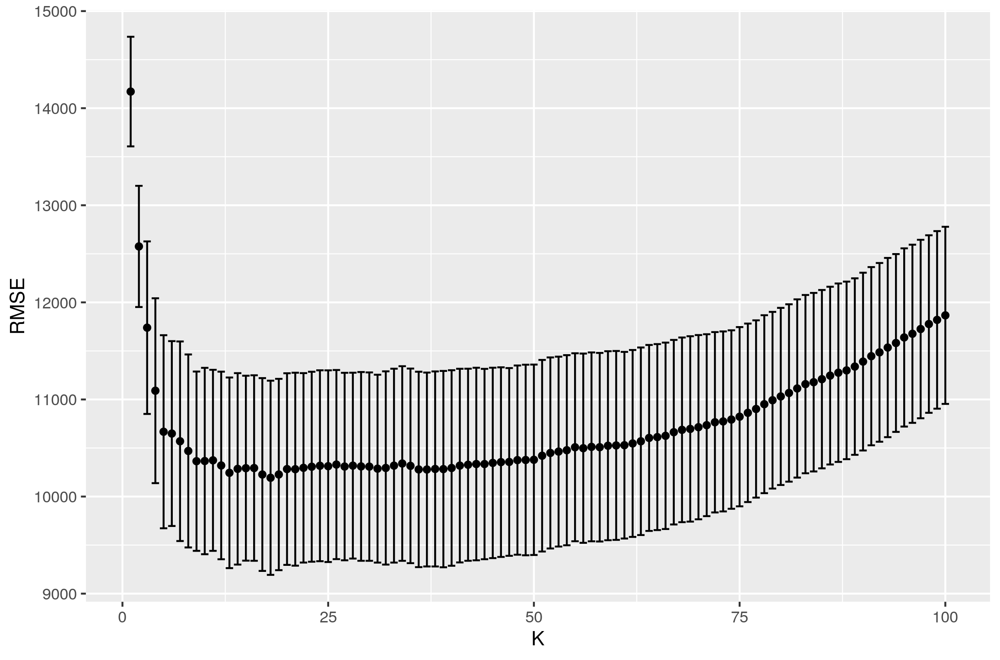

The optimal K = 18 with an average RMSE of 10193.5, and the price predictions for trim 350 is shown as follows. The red line represents the predicted price, while the scatter points represent the actual price.

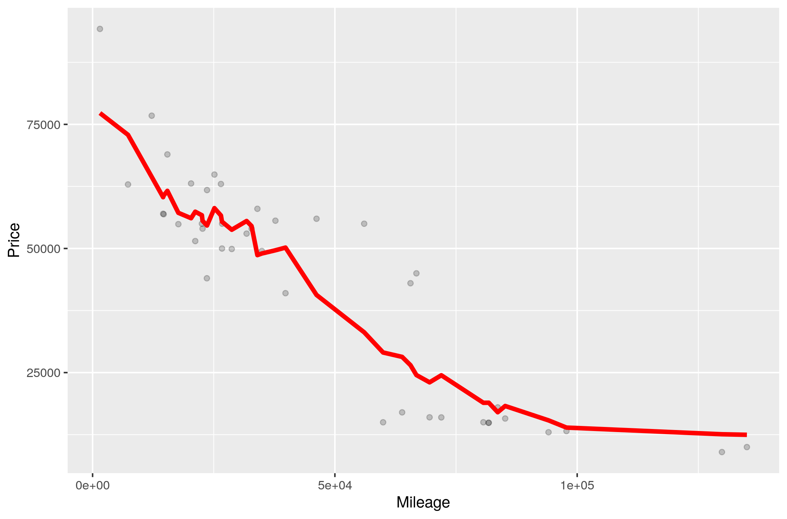

We can repeat the process for trim 63 AMG.

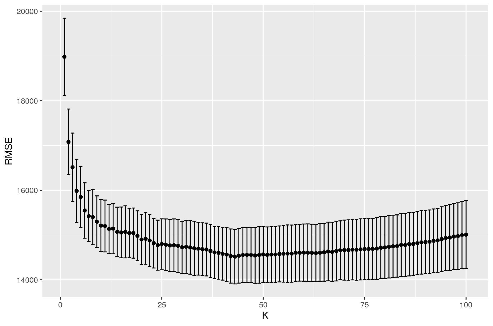

The optimal K = 43 with an average RMSE of 14517.7, and the price predictions for trim 63 AMG is shown as follows. The red line represents the predicted price, while the scatter points represent the actual price.

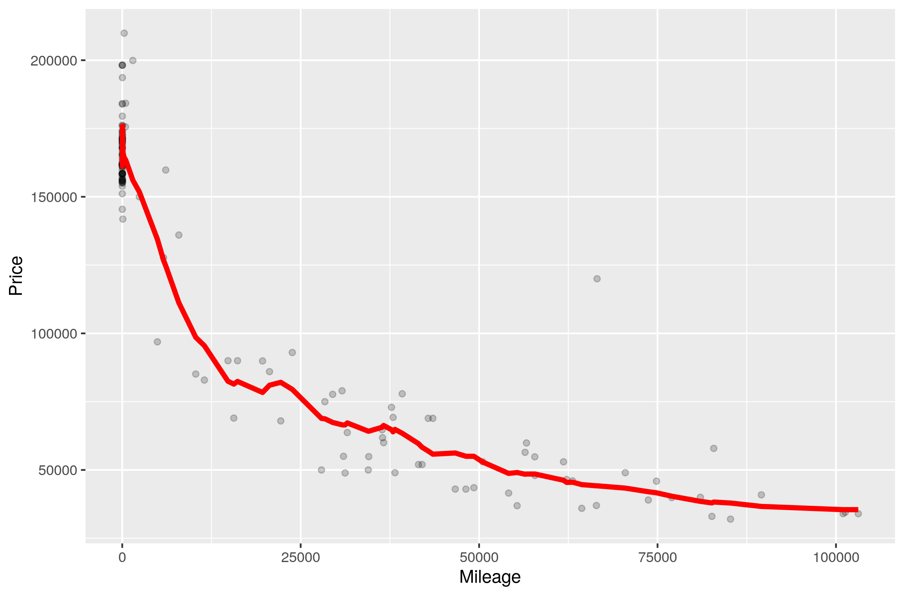

Trim 63 AMG yields a larger optimal value of K because it has more samples in the dataset.


