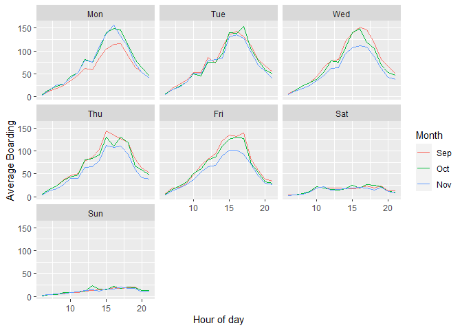
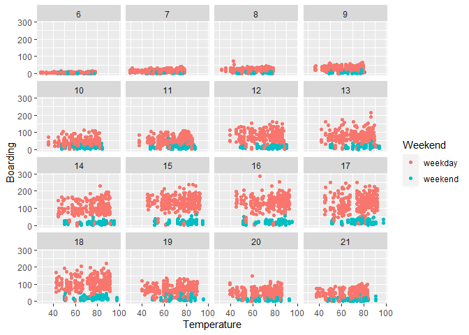
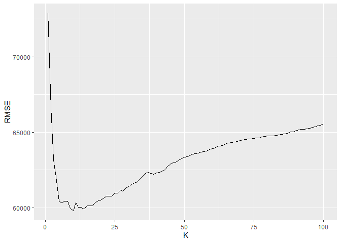
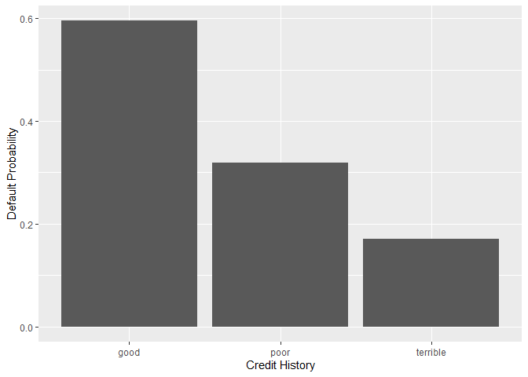
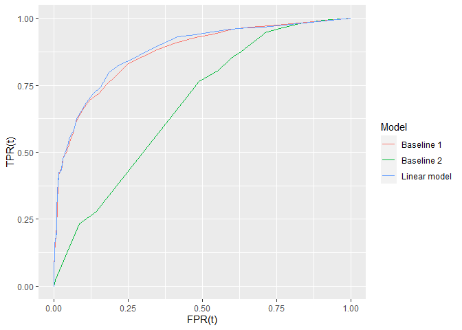

1) Visualization
----------------

### A) One panel of line graphs that plots average boardings grouped by hour of the day, day of week, and month.

The panel of line graphs show that the hour of peak boardings change
according to weekdays and weekends. Specifially, the boardings on
weekdays share the same pattern, which is unimodal at 17:00. By
contrast, the boradings on weekdends are much more flat.

We can also find some month-specific insights from the graphs. For
example, average boardings on Mondays in September look lower.
Similarly, average boardings on Weds/Thurs/Fri in November also look
lower. Those insights can be illustrated by holidays, i.e., Labor day in
September and Thanksgiving in November. On holidays, most people don’t
need to go to work, and it causes the reduction in the daily boarding.

### B) One panel of scatter plots showing boardings (y) vs. Nch 15-minute window, faceted by hour of the day, and with points colored in according to whether it is a weekday or weekend.

The panel of scatter plots show the relationship between boardings and
temperature. Compared to the weekday boardings, boardings on weekends
seems less when the temperature is low, given the hour of day kept
constant. However, the effect is not significant, and we also need to
notice that the sample on weekends are not enough to support stong
argument that involves mutiple factors.

2) Saratoga house prices
------------------------

### A) Linear model

Recall the medium linear model in class, coefficients can be expressed
as follows.

    ##            (Intercept)                lotSize                    age 
    ##            47572.90160             8664.82139              -50.08371 
    ##             livingArea               bedrooms             fireplaces 
    ##               94.54623           -12297.40625             4696.26451 
    ##              bathrooms                  rooms heatinghot water/steam 
    ##            16873.27166             2258.31867            -9071.89617 
    ##        heatingelectric           fuelelectric                fueloil 
    ##            -1942.07453           -12935.16812            -6883.11937 
    ##           centralAirNo 
    ##           -20590.20701

Now we use the step regression based on the above medium linear model,
and thus obtain the following best linear model with following
coeffecients.

    ##                      (Intercept)                          lotSize 
    ##                     3.495566e+04                     1.352939e+04 
    ##                              age                       livingArea 
    ##                    -6.069829e+02                     7.671094e+01 
    ##                         bedrooms                       fireplaces 
    ##                    -5.839182e+02                     2.059099e+04 
    ##                        bathrooms                            rooms 
    ##                     4.117881e+04                     1.729925e+03 
    ##           heatinghot water/steam                  heatingelectric 
    ##                     3.270503e+04                     5.298728e+04 
    ##                     fuelelectric                          fueloil 
    ##                    -3.127782e+04                     7.543519e+04 
    ##                     centralAirNo                        landValue 
    ##                     8.169018e+04                     2.739932e-01 
    ##                     waterfrontNo                newConstructionNo 
    ##                    -7.209968e+04                     3.174458e+04 
    ##          livingArea:centralAirNo      landValue:newConstructionNo 
    ##                    -2.560724e+01                     7.793577e-01 
    ## bathrooms:heatinghot water/steam        bathrooms:heatingelectric 
    ##                    -6.110831e+03                    -2.325186e+04 
    ##                   age:livingArea            bedrooms:centralAirNo 
    ##                    -1.647959e-01                     1.311704e+04 
    ##             fireplaces:landValue            livingArea:fireplaces 
    ##                    -4.675173e-01                     1.729308e+01 
    ##                lotSize:landValue        fuelelectric:centralAirNo 
    ##                    -2.023532e-01                     1.466101e+04 
    ##             fueloil:centralAirNo          livingArea:fuelelectric 
    ##                    -4.185082e+04                     8.004105e+00 
    ##               livingArea:fueloil                 age:centralAirNo 
    ##                    -2.217910e+01                     6.785615e+02 
    ##                  rooms:landValue               bedrooms:bathrooms 
    ##                     5.232663e-02                    -6.307776e+03 
    ##        centralAirNo:waterfrontNo     fireplaces:newConstructionNo 
    ##                    -7.723269e+04                    -3.121949e+04 
    ##     rooms:heatinghot water/steam            rooms:heatingelectric 
    ##                    -3.977676e+03                    -2.124625e+03 
    ##   centralAirNo:newConstructionNo 
    ##                    -2.207937e+04

The out-of-sample RMSE for the best linear model is 7.181551210^{4},
which indicates it significantly outperforms the medium linear model
whose RMSE is 7.595313110^{4}.

### B) K-nearest-neighbor regression model

Now we begin to build the K-nearest-neighbor regression model. From the
RMSE plot, we find the optimal K obtained from training set is 10 with
RMSE 5.981264110^{4}.

Next, we do prediction using the optimal K, with RMSE 7.202816510^{4}.
The KNN model seems to have similar performance on
achievingout-of-sample mean-squared error compared to linear model. The
reason behind may be that the price doesn’t not have a clear linear
relationship with other factors, and thus linear model fails to
outperform than KNN model.

3) Classification and retrospective sampling
--------------------------------------------

We first make a bar plot of default probability by credit history. As
depicited in the figure, borrowers with good history have a significant
higher default probability, while borrowers with terrible history have a
significant lower default probability.

    ##         (Intercept)            duration              amount         installment 
    ##       -7.075258e-01        2.525834e-02        9.596288e-05        2.216019e-01 
    ##                 age         historypoor     historyterrible          purposeedu 
    ##       -2.018401e-02       -1.107586e+00       -1.884675e+00        7.247898e-01 
    ## purposegoods/repair       purposenewcar      purposeusedcar       foreigngerman 
    ##        1.049037e-01        8.544560e-01       -7.959260e-01       -1.264676e+00

We then build a logistic regression model using the variables duration,
amount, installment, age, history, propose and foreign. We notice that
history and foreign are two deterministic factors in the logistric
regression model. However, we need to note that the dataset is highly
unbalanced. As a major factor, the data with good history only accounts
for 8% of the dataset. Therefore, the dataset is not appropriate for
building a predictive model of defaults. The bank need to resample to
create a dataset with credit history factor evenly-distributed in good,
poor and terrible.

4) Children and hotel reservations
----------------------------------

### A) Model building

We first build the baseline 1 model with RMSE 0.2739668.

    ##                  (Intercept)  market_segmentComplementary 
    ##                 -0.021921674                  0.075196966 
    ##      market_segmentCorporate         market_segmentDirect 
    ##                  0.012400345                  0.113988625 
    ##         market_segmentGroups  market_segmentOffline_TA/TO 
    ##                  0.005515186                  0.021145168 
    ##      market_segmentOnline_TA                       adults 
    ##                  0.078065990                  0.018419743 
    ##           customer_typeGroup       customer_typeTransient 
    ##                 -0.024498862                  0.017597977 
    ## customer_typeTransient-Party            is_repeated_guest 
    ##                 -0.009006362                 -0.040110060

We then build the baseline 1 model with RMSE 0.2368267.

    ##                        (Intercept)                  hotelResort_Hotel 
    ##                      -5.537098e-02                      -3.369556e-02 
    ##                          lead_time            stays_in_weekend_nights 
    ##                       4.307495e-05                       2.888412e-03 
    ##               stays_in_week_nights                             adults 
    ##                      -5.424955e-04                      -3.796772e-02 
    ##                             mealFB                             mealHB 
    ##                       5.412204e-02                       2.342481e-03 
    ##                             mealSC                      mealUndefined 
    ##                      -5.276027e-02                       1.624955e-02 
    ##        market_segmentComplementary            market_segmentCorporate 
    ##                       4.963156e-02                       4.302485e-02 
    ##               market_segmentDirect               market_segmentGroups 
    ##                       4.684327e-02                       5.796469e-02 
    ##        market_segmentOffline_TA/TO            market_segmentOnline_TA 
    ##                       7.068539e-02                       6.606351e-02 
    ##         distribution_channelDirect            distribution_channelGDS 
    ##                       1.908531e-02                      -7.813997e-02 
    ##          distribution_channelTA/TO                  is_repeated_guest 
    ##                       4.796705e-04                      -2.639743e-02 
    ##             previous_cancellations     previous_bookings_not_canceled 
    ##                       5.018750e-04                      -2.087076e-03 
    ##                reserved_room_typeB                reserved_room_typeC 
    ##                       1.877671e-01                       5.278363e-01 
    ##                reserved_room_typeD                reserved_room_typeE 
    ##                      -6.765244e-02                      -2.350776e-02 
    ##                reserved_room_typeF                reserved_room_typeG 
    ##                       3.130437e-01                       4.524950e-01 
    ##                reserved_room_typeH                reserved_room_typeL 
    ##                       5.750602e-01                      -8.430431e-02 
    ##                assigned_room_typeB                assigned_room_typeC 
    ##                       1.658032e-02                       8.406437e-02 
    ##                assigned_room_typeD                assigned_room_typeE 
    ##                       6.089383e-02                       4.739679e-02 
    ##                assigned_room_typeF                assigned_room_typeG 
    ##                       6.018681e-02                       6.970742e-02 
    ##                assigned_room_typeH                assigned_room_typeI 
    ##                       8.543261e-02                       8.309765e-02 
    ##                assigned_room_typeK                    booking_changes 
    ##                       3.049353e-02                       1.860330e-02 
    ##             deposit_typeNon_Refund             deposit_typeRefundable 
    ##                       2.645025e-02                       2.029179e-02 
    ##               days_in_waiting_list                 customer_typeGroup 
    ##                      -2.482819e-05                      -1.201392e-02 
    ##             customer_typeTransient       customer_typeTransient-Party 
    ##                       1.065507e-02                      -3.069101e-02 
    ##                 average_daily_rate required_car_parking_spacesparking 
    ##                       8.807650e-04                      -8.971335e-04 
    ##          total_of_special_requests 
    ##                       3.070370e-02

We finally build the baseline 3 model with RMSE 0.2359201, including
features extracted from arrival\_date.

    ##                    (Intercept)              hotelResort_Hotel 
    ##                  -9.990680e-03                  -3.543901e-02 
    ##                      lead_time                         adults 
    ##                   7.474187e-05                  -4.222817e-02 
    ##                         mealFB                         mealHB 
    ##                   3.665133e-02                  -2.133504e-03 
    ##                         mealSC                  mealUndefined 
    ##                  -5.125016e-02                   1.102493e-03 
    ##    market_segmentComplementary        market_segmentCorporate 
    ##                   4.510025e-02                   3.163675e-02 
    ##           market_segmentDirect           market_segmentGroups 
    ##                   3.557828e-02                   5.369725e-02 
    ##    market_segmentOffline_TA/TO        market_segmentOnline_TA 
    ##                   6.531828e-02                   5.683293e-02 
    ##     distribution_channelDirect        distribution_channelGDS 
    ##                   1.450391e-02                  -7.832665e-02 
    ##      distribution_channelTA/TO              is_repeated_guest 
    ##                  -5.419742e-03                  -2.556519e-02 
    ## previous_bookings_not_canceled            reserved_room_typeB 
    ##                  -2.094017e-03                   1.679791e-01 
    ##            reserved_room_typeC            reserved_room_typeD 
    ##                   5.175863e-01                  -6.552732e-02 
    ##            reserved_room_typeE            reserved_room_typeF 
    ##                  -2.560130e-02                   3.062545e-01 
    ##            reserved_room_typeG            reserved_room_typeH 
    ##                   4.441215e-01                   5.609206e-01 
    ##            reserved_room_typeL            assigned_room_typeB 
    ##                  -1.085974e-01                   2.374855e-02 
    ##            assigned_room_typeC            assigned_room_typeD 
    ##                   9.061320e-02                   5.946909e-02 
    ##            assigned_room_typeE            assigned_room_typeF 
    ##                   4.992107e-02                   6.529848e-02 
    ##            assigned_room_typeG            assigned_room_typeH 
    ##                   7.634868e-02                   9.895191e-02 
    ##            assigned_room_typeI            assigned_room_typeK 
    ##                   8.507790e-02                   3.095898e-02 
    ##                booking_changes             customer_typeGroup 
    ##                   1.860050e-02                  -1.814549e-02 
    ##         customer_typeTransient   customer_typeTransient-Party 
    ##                   1.117921e-03                  -3.932923e-02 
    ##             average_daily_rate      total_of_special_requests 
    ##                   9.234913e-04                   3.090322e-02 
    ##                  arrival_wday2                  arrival_wday3 
    ##                  -4.871997e-03                  -8.531548e-03 
    ##                  arrival_wday4                  arrival_wday5 
    ##                  -1.195103e-02                  -3.694595e-03 
    ##                  arrival_wday6                  arrival_wday7 
    ##                  -1.384405e-02                   6.264902e-03 
    ##                 arrival_month2                 arrival_month3 
    ##                   2.134404e-02                  -3.615730e-03 
    ##                 arrival_month4                 arrival_month5 
    ##                  -6.089776e-03                  -3.832035e-02 
    ##                 arrival_month6                 arrival_month7 
    ##                  -3.871045e-02                   1.489108e-02 
    ##                 arrival_month8                 arrival_month9 
    ##                   7.370045e-03                  -5.181329e-02 
    ##                arrival_month10                arrival_month11 
    ##                  -2.842536e-02                  -3.062332e-02 
    ##                arrival_month12               arrival_year2016 
    ##                   4.406094e-03                   4.353419e-03 
    ##               arrival_year2017 
    ##                  -1.202295e-02

### B) Model validation: step 1

In step 1, we plot ROC curves for the three model using dataset
hotels\_dev, with threshold varys from 0 to 1. Those curves indicate
that linear model and baseline 2 are significantly better than baseline
1.

### C) Model validation: step 2

In step 2, we create 20 folds of hotels\_Val, predict whether each
booking will have children on it using above 3 model, and compare
predictions. The threshold is set as 0.41, which is determinted by
maximizing the F1 score. We can find that baseline 2 and linear model
behave similarly, but there are still gaps between predictions and true
value.

<table>
<colgroup>
<col style="width: 19%" />
<col style="width: 26%" />
<col style="width: 26%" />
<col style="width: 26%" />
</colgroup>
<thead>
<tr class="header">
<th style="text-align: right;">True Probability</th>
<th style="text-align: right;">Predicted Probability 1</th>
<th style="text-align: right;">Predicted Probability 2</th>
<th style="text-align: right;">Predicted Probability 3</th>
</tr>
</thead>
<tbody>
<tr class="odd">
<td style="text-align: right;">0.0803213</td>
<td style="text-align: right;">0</td>
<td style="text-align: right;">0.0441767</td>
<td style="text-align: right;">0.0441767</td>
</tr>
<tr class="even">
<td style="text-align: right;">0.0760000</td>
<td style="text-align: right;">0</td>
<td style="text-align: right;">0.0440000</td>
<td style="text-align: right;">0.0440000</td>
</tr>
<tr class="odd">
<td style="text-align: right;">0.0680000</td>
<td style="text-align: right;">0</td>
<td style="text-align: right;">0.0600000</td>
<td style="text-align: right;">0.0520000</td>
</tr>
<tr class="even">
<td style="text-align: right;">0.0480000</td>
<td style="text-align: right;">0</td>
<td style="text-align: right;">0.0360000</td>
<td style="text-align: right;">0.0360000</td>
</tr>
<tr class="odd">
<td style="text-align: right;">0.1040000</td>
<td style="text-align: right;">0</td>
<td style="text-align: right;">0.0520000</td>
<td style="text-align: right;">0.0480000</td>
</tr>
<tr class="even">
<td style="text-align: right;">0.0680000</td>
<td style="text-align: right;">0</td>
<td style="text-align: right;">0.0400000</td>
<td style="text-align: right;">0.0320000</td>
</tr>
<tr class="odd">
<td style="text-align: right;">0.1080000</td>
<td style="text-align: right;">0</td>
<td style="text-align: right;">0.0640000</td>
<td style="text-align: right;">0.0640000</td>
</tr>
<tr class="even">
<td style="text-align: right;">0.0880000</td>
<td style="text-align: right;">0</td>
<td style="text-align: right;">0.0720000</td>
<td style="text-align: right;">0.0720000</td>
</tr>
<tr class="odd">
<td style="text-align: right;">0.0800000</td>
<td style="text-align: right;">0</td>
<td style="text-align: right;">0.0520000</td>
<td style="text-align: right;">0.0520000</td>
</tr>
<tr class="even">
<td style="text-align: right;">0.1120000</td>
<td style="text-align: right;">0</td>
<td style="text-align: right;">0.0840000</td>
<td style="text-align: right;">0.0760000</td>
</tr>
<tr class="odd">
<td style="text-align: right;">0.0880000</td>
<td style="text-align: right;">0</td>
<td style="text-align: right;">0.0600000</td>
<td style="text-align: right;">0.0560000</td>
</tr>
<tr class="even">
<td style="text-align: right;">0.0800000</td>
<td style="text-align: right;">0</td>
<td style="text-align: right;">0.0480000</td>
<td style="text-align: right;">0.0480000</td>
</tr>
<tr class="odd">
<td style="text-align: right;">0.1080000</td>
<td style="text-align: right;">0</td>
<td style="text-align: right;">0.0600000</td>
<td style="text-align: right;">0.0600000</td>
</tr>
<tr class="even">
<td style="text-align: right;">0.0720000</td>
<td style="text-align: right;">0</td>
<td style="text-align: right;">0.0520000</td>
<td style="text-align: right;">0.0480000</td>
</tr>
<tr class="odd">
<td style="text-align: right;">0.0800000</td>
<td style="text-align: right;">0</td>
<td style="text-align: right;">0.0640000</td>
<td style="text-align: right;">0.0680000</td>
</tr>
<tr class="even">
<td style="text-align: right;">0.0600000</td>
<td style="text-align: right;">0</td>
<td style="text-align: right;">0.0360000</td>
<td style="text-align: right;">0.0320000</td>
</tr>
<tr class="odd">
<td style="text-align: right;">0.0720000</td>
<td style="text-align: right;">0</td>
<td style="text-align: right;">0.0520000</td>
<td style="text-align: right;">0.0520000</td>
</tr>
<tr class="even">
<td style="text-align: right;">0.0760000</td>
<td style="text-align: right;">0</td>
<td style="text-align: right;">0.0520000</td>
<td style="text-align: right;">0.0480000</td>
</tr>
<tr class="odd">
<td style="text-align: right;">0.0760000</td>
<td style="text-align: right;">0</td>
<td style="text-align: right;">0.0560000</td>
<td style="text-align: right;">0.0560000</td>
</tr>
<tr class="even">
<td style="text-align: right;">0.0640000</td>
<td style="text-align: right;">0</td>
<td style="text-align: right;">0.0600000</td>
<td style="text-align: right;">0.0560000</td>
</tr>
</tbody>
</table>
